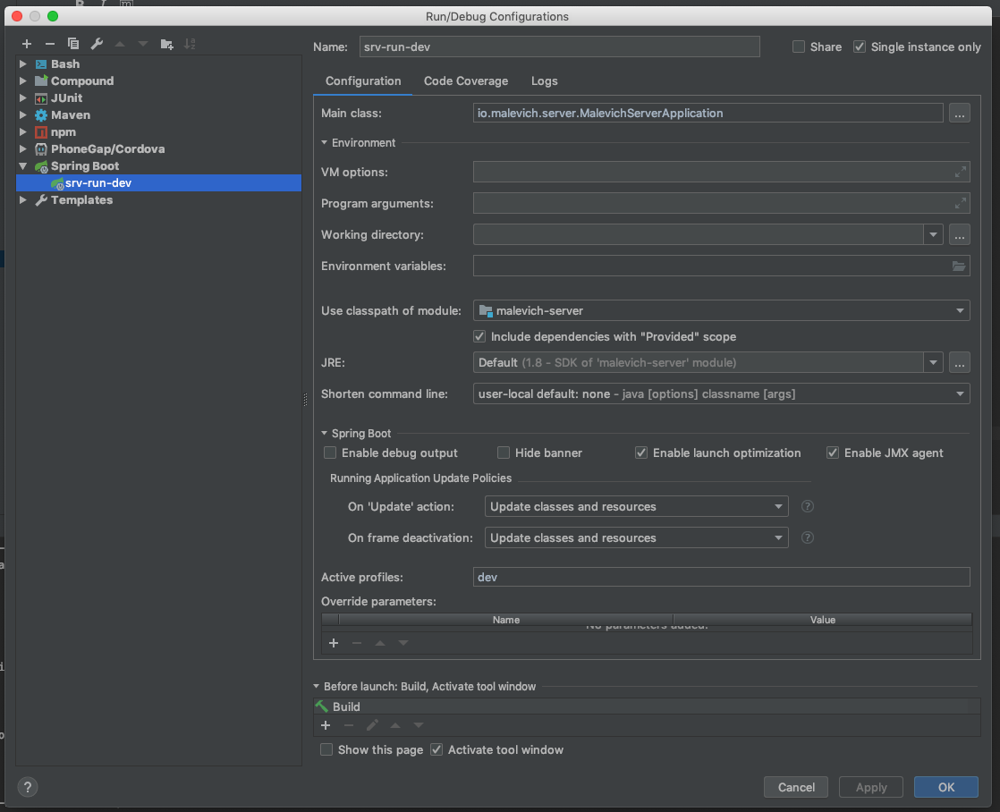

# Malevich

## Profiles explained

dev - local developers environment;
test - test server;
prod - unused at the moment no production Environment present.

## Git

To avoid EOL issues on Windows:

```
git config --global core.autocrlf true
rm .git/index
git reset --hard
```

## Docker Environment

**MySQL:**

docker run -d -p 3306:3306 --name mysql --restart=unless-stopped \
--env="MYSQL_ROOT_PASSWORD=Orion123" mysql:5.7.23

**Hyperledger**

docker run --name composer-inception --privileged -d \
--env="BN_NAME=malevich-network" \
-v <your path>/malevich/malevich-network/target/malevich-network.bna:/home/dockremap/malevich-network.bna \
-p 3000:3000 -p 9090:9090 --restart=unless-stopped composer-inception:0.0


## Run configurations


**web-run-dev**
<p align="center">
  
</p>


**network-build-dev**
<p align="center">
  
</p>


**srv-run-dev**
<p align="center">
  
</p>


**mobile-run-dev**
<p align="center">
  
</p>


**liquibase-update-dev**
<p align="center">
  
</p>


## Dev Database connection

**root@dev**
<p align="center">
  
</p>


## Running the applications

**Step one - setup configurations**

-0- Setup All Run configurations for the dev environment.
-1- Create connection to the dev database.


**Step two - setup environment**
-0- Build business network by executing: network-build-dev maven goal.

-1- Build docker image by executing ./malevich-fabric/build.sh. 
Note: in case of the windows you need to open this file and execute docker build command by hand using Windows CMD (Windows CMD ONLY!)
 
-2- Run MySQL docker container.

-3- Execute src/database_scripts/mysql/01_create_database.sql using root@dev DB connection.

-4- Run liquibase-update-dev configuration

-5- Run Composer Inception docker container. 
Note: for Composer Inception Image you need to provide a full path to your malevich folder.

Note: in case of the windows execute using Windows CMD (Windows CMD ONLY!)

-6- Execute docker logs -f composer-inception
-7- Wait till you will see messages:

Web server listening at: http://localhost:3000

Browse your REST API at http://localhost:3000/explorer


-8- Press Ctrl + C


**Step Three - run the applications**

-0- Execute srv-run-dev.

-1- Execute web-run-dev or mobile-run-dev or both, depending on what you are going to use at the moment.

-3- If installation been done properly you will be able to connect to the application using urls from the next section.


## URLs
Angular App: http://localhost:4200

Mobile App: http://localhost:8100

Spring Boot: http://localhost:8080


Docker Playground: http://localhost:9090

Docker REST Server: http://localhost:3000/explorer/


## Build configurations

(!!!!!!) Don't even setup if you not sure what are these for!!!

**web-build-test**
<p align="center">
  
</p>


**network-build-test**
<p align="center">
  
</p>


**srv-build-test**
<p align="center">
  
</p>


**liquibase-update-test**
<p align="center">
  
</p>


## Test Database connection

(!!!!!!) Don't even setup if you not sure what are these for!!!

**root@test**
<p align="center">
  
</p>